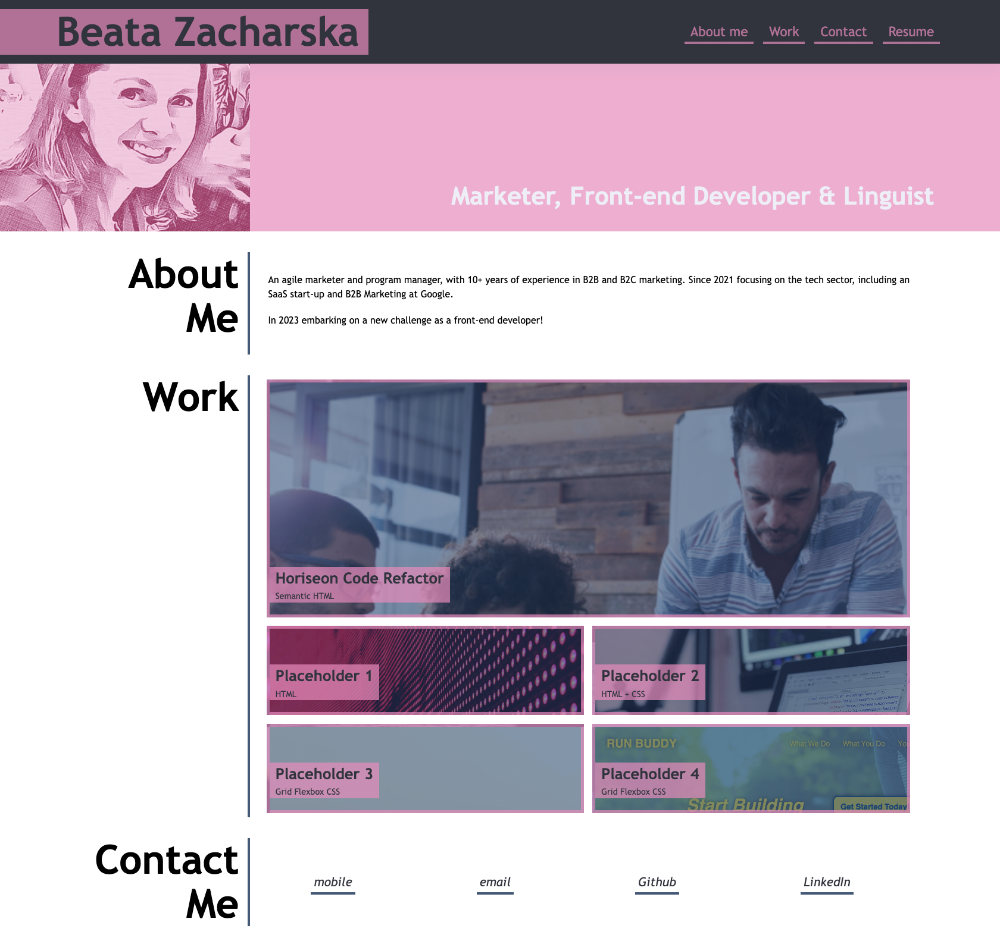
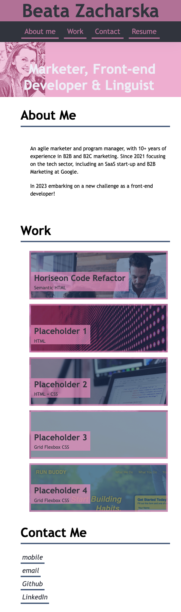
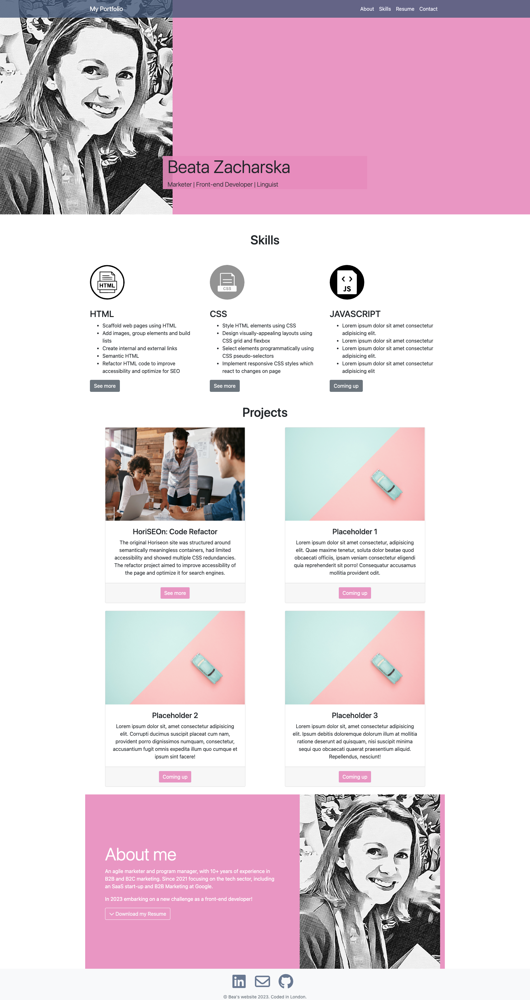
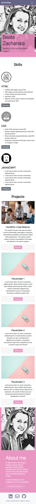

# Beata-Bootstrap-Portfolio
Deployed link: https://beazach.github.io/beata-bootstrap-portfolio/

## Description 
This is a professional portfolio built in Bootstrap showcasing the work I've completed during the developers' bootcamp, with each section displaying different projects, including links to deployed applications and GitHub repositories.

The application includes:
- Skills
- Projects
- About 
- Contact

Each section includes relevant links. 

## Usage
The look and feel of the page has been customised based on the previous Portfolio mock-up and developer's own preference.

## Previous Portfolio
#### Desktop view:

#### Mobile view:

## Bootstrap Portfolio
#### Desktop view:

#### Mobile view:

## Contact Details
Please use contact details to get in touch about future projects and collaborations (and if you have any suggestions for improvements!).

## License 
MIT

## Resources 
https://fantastic-pudding.vercel.app/03-ux-bootstrap-module/ (last accessed 1 January 2023)
